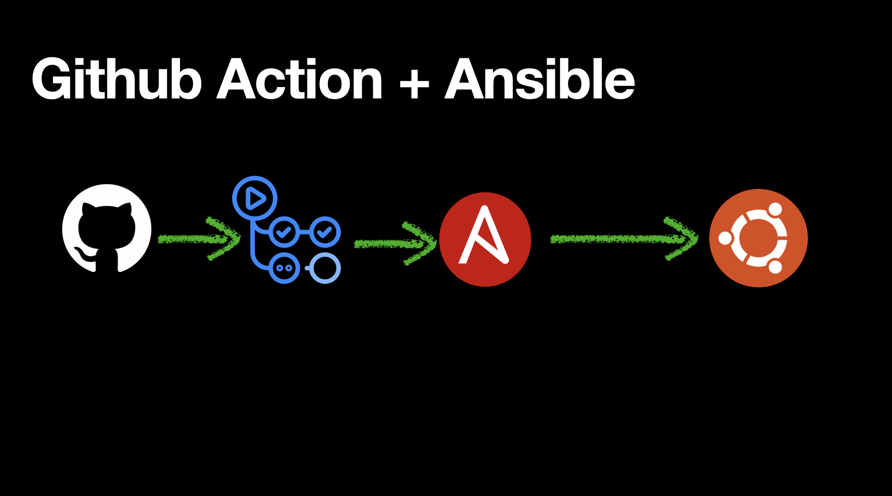

# 🛠️ GitHub Actions + Ansible: Install NGINX on Ubuntu Linux

This repository demonstrates how to automate the installation of **NGINX** on a remote **Ubuntu Linux** server using **GitHub Actions** and **Ansible**.

---

## 🧩 Overview

We’ll set up a GitHub Actions workflow that:
1. Uses Ansible to connect to a remote Ubuntu host.
2. Runs a playbook to install and start the NGINX service.

---

## 📝 Prerequisites

- A remote Ubuntu Linux server (tested on Ubuntu 20.04+).
- SSH access to the server (with a private key).
- A GitHub repository.
- A basic understanding of Ansible and GitHub Actions.

---

## 🔑 SSH Key Setup

1. **Generate SSH key named `ansible_key`** on your local machine:

   ```bash
   ssh-keygen -t rsa -b 4096 -f ~/.ssh/ansible_key
This creates:

~/.ssh/ansible_key (private key)

~/.ssh/ansible_key.pub (public key)

Copy the public key to your Ubuntu server:

ssh-copy-id -i ~/.ssh/ansible_key.pub <user>@<host>
Replace <user> with your SSH username (e.g., ubuntu) and <host> with your server's IP or domain.

🔐 Setup Secrets in GitHub
Go to your repository > Settings > Secrets and variables > Actions > New repository secret:

Name	Description
SSH_PRIVATE_KEY	Content of your ansible_key (private key)
HOST	IP address or domain of the server
USER	SSH username (e.g., ubuntu)
To copy the private key to your clipboard:

bash
Copy
Edit
cat ~/.ssh/ansible_key
Then paste it into the SSH_PRIVATE_KEY secret.

📁 Repository Structure
```
.
├── .github
│   └── workflows
│       └── deploy-nginx.yml     # GitHub Actions workflow
├── ansible
│   ├── hosts                    # Inventory file
│   └── install-nginx.yml       # Ansible playbook
├── README.md

```
📦 Ansible Playbook
ansible/install-nginx.yml:

yaml
- name: Install and start NGINX
  hosts: webservers
  become: yes

  tasks:
    - name: Install NGINX
      apt:
        name: nginx
        state: present
        update_cache: yes

    - name: Ensure NGINX is running
      service:
        name: nginx
        state: started
        enabled: yes

🗂️ Inventory File
[webservers]
{{ HOST }}
The {{ HOST }} placeholder will be dynamically replaced in the workflow.

🤖 GitHub Actions Workflow
.github/workflows/deploy-nginx.yml:
```
on:
  push:
    branches:
    - main
  workflow_dispatch:
    # allows manual trigger from the Actions tab

jobs:
  run-ansible:
    runs-on: ubuntu-latest

    env:
      TARGET_HOST: ${{ secrets.TARGET_HOST }}

    steps:
    - name: Checkout code
      uses: actions/checkout@v3

    - name: Install Ansible
      run: |
        sudo apt update
        sudo apt install -y ansible

    - name: Set up SSH key
      run: |
        mkdir -p ~/.ssh
        echo "${{ secrets.ANSIBLE_SSH_PRIVATE_KEY }}" > ~/.ssh/id_rsa
        chmod 600 ~/.ssh/id_rsa
        ssh-keyscan -H "$TARGET_HOST" >> ~/.ssh/known_hosts
      shell: bash

    - name: Create dynamic inventory
      run: |
        echo "[webservers]" > hosts.ini
        echo "$TARGET_HOST ansible_user=ubuntu ansible_ssh_private_key_file=~/.ssh/id_rsa" >> hosts.ini

    - name: Test manual SSH connection (debug)
      run: |
        ssh -o StrictHostKeyChecking=no -i ~/.ssh/id_rsa ubuntu@$TARGET_HOST "echo 'SSH Success 🎉'"

    - name: Run Ansible Playbook
      run: |
        ansible-playbook nginx_hello.yml -i hosts.ini
```

✅ Test It Out
Push your code to the main branch.

Go to Actions tab.

Watch the workflow run and deploy NGINX.

🔍 Verify
SSH into your server and run:

curl -I http://localhost
You should see an HTTP 200 response from NGINX.

🧼 Cleanup
To remove NGINX:

sudo apt remove nginx -y
sudo apt autoremove -y

📄 License
MIT License


